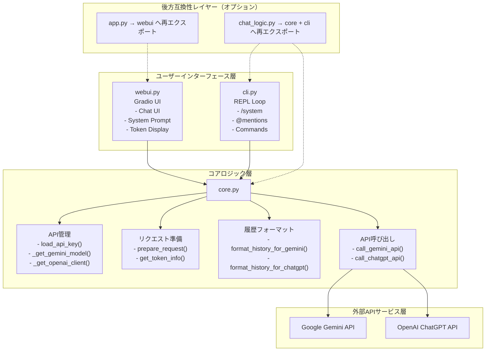
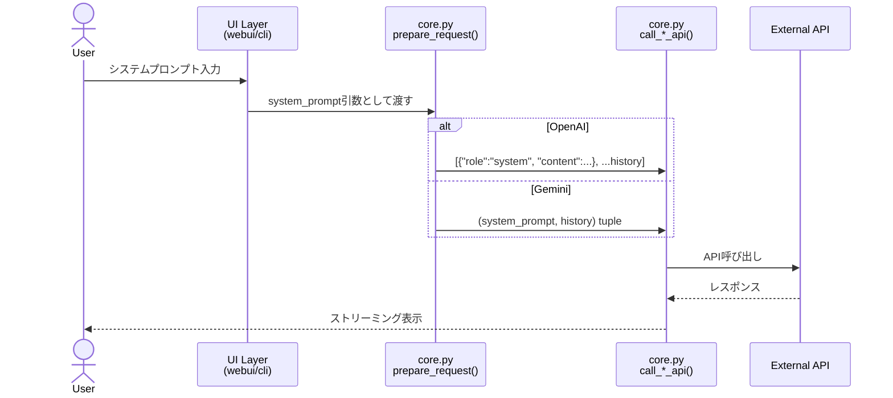
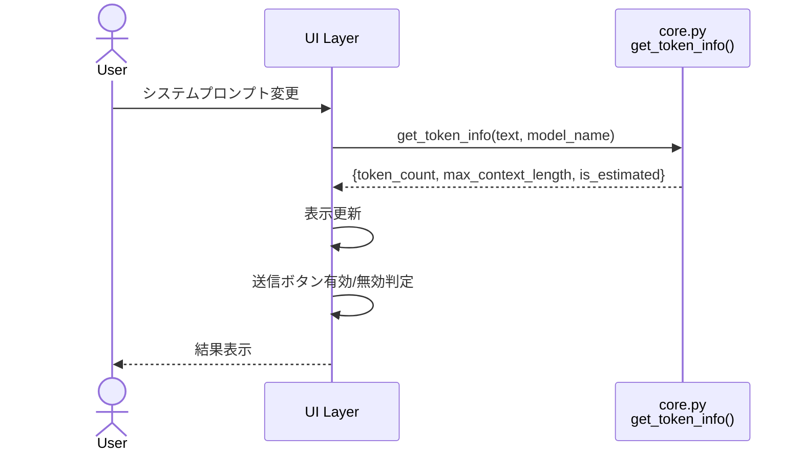

# アーキテクチャ設計書

## 概要

Multi-LLM Chatは、複数のLLM（Gemini、ChatGPT）との対話を統一的に管理するPythonアプリケーションです。Epic 009のリファクタリングにより、責務分離された3層アーキテクチャを採用しました。

## アーキテクチャ全体図



## モジュール設計

### 1. コアロジック層: `src/multi_llm_chat/core.py`

**責務**: UIに依存しない共通ロジック

#### 主要機能

| 機能カテゴリ | 関数/変数 | 説明 |
|------------|----------|------|
| **設定管理** | `GOOGLE_API_KEY`, `OPENAI_API_KEY`, `GEMINI_MODEL`, `CHATGPT_MODEL` | 環境変数から読み込まれる設定 |
| | `load_api_key(env_var_name)` | 環境変数からAPIキーを読み込む |
| **APIクライアント管理** | `_get_gemini_model()` | Geminiモデルインスタンスをキャッシュして返す |
| | `_get_openai_client()` | OpenAIクライアントをキャッシュして返す |
| **トークン計算** | `get_token_info(text, model_name)` | テキストのトークン数、最大コンテキスト長、推定フラグを返す |
| **リクエスト準備** | `prepare_request(history, system_prompt, model_name)` | モデル別にシステムプロンプトと履歴を整形 |
| **履歴フォーマット** | `format_history_for_gemini(history)` | Gemini API形式に変換 |
| | `format_history_for_chatgpt(history)` | ChatGPT API形式に変換 |
| **API呼び出し** | `call_gemini_api(history, system_prompt=None)` | Gemini APIをストリーミング呼び出し |
| | `call_chatgpt_api(history, system_prompt=None)` | ChatGPT APIをストリーミング呼び出し |
| **ユーティリティ** | `list_gemini_models()` | 利用可能なGeminiモデルを一覧表示 |

#### 設計原則
- **UI非依存**: `print()`や`input()`を使わない（例外: デバッグ用`list_gemini_models()`）
- **ステートレス**: 関数は引数から全ての情報を受け取る
- **キャッシング**: APIクライアントはモジュールレベルでキャッシュ

### 2. ユーザーインターフェース層

#### 2.1 Web UI: `src/multi_llm_chat/webui.py`

**責務**: Gradio UIの実装

##### 主要機能

| コンポーネント | 関数/変数 | 説明 |
|-------------|----------|------|
| **UI関数** | `update_token_display(system_prompt, model_name)` | トークン数表示を更新 |
| | `check_send_button_enabled(system_prompt, model_name)` | 送信ボタンの有効/無効を判定 |
| | `respond(user_message, display_history, logic_history, system_prompt)` | チャット応答の中心関数 |
| **起動関数** | `launch(server_name=None, debug=True)` | Gradioアプリを起動 |
| **UI要素** | `demo` | Gradio Blocksインスタンス |
| | `system_prompt_input` | システムプロンプト入力欄 |
| | `token_display` | トークンカウント表示 |
| | `chatbot_ui` | チャット表示エリア |

##### 特殊処理
- **Gradioバグ回避**: JSON Schema内のbool型処理のためのモンキーパッチ適用

#### 2.2 CLI: `src/multi_llm_chat/cli.py`

**責務**: コマンドラインインターフェースの実装

##### 主要機能

| 機能 | 関数/変数 | 説明 |
|------|----------|------|
| **メインループ** | `main()` | REPLループ、`(history, system_prompt)`を返す |
| **コマンド処理** | `_handle_system_command(args, system_prompt, current_model)` | `/system`コマンドの処理 |
| **応答処理** | `_process_response_stream(stream, model_name)` | ストリーミング応答の表示 |
| **ユーティリティ** | `_clone_history(history)` | 履歴の浅いコピーを作成 |

##### サポートするコマンド

| コマンド | 説明 |
|---------|------|
| `/system <prompt>` | システムプロンプトを設定 |
| `/system` | 現在のシステムプロンプトを表示 |
| `/system clear` | システムプロンプトをクリア |
| `exit` / `quit` | CLIを終了 |

##### メンション機能

| メンション | 動作 |
|-----------|------|
| `@gemini <message>` | Geminiに送信 |
| `@chatgpt <message>` | ChatGPTに送信 |
| `@all <message>` | 両方に送信（履歴は分岐前のスナップショット） |
| メンションなし | 思考メモとして履歴に追加のみ |

### 3. 互換性レイヤー（オプション）

#### 3.1 `src/multi_llm_chat/app.py`

旧インターフェースを維持するため、`webui`モジュールの`demo`, `launch`, `respond`を再エクスポート。

```python
from .webui import demo, launch, respond
__all__ = ["demo", "launch", "respond"]
```

#### 3.2 `src/multi_llm_chat/chat_logic.py`

旧インターフェースを維持するため、`core`と`cli`モジュールの関数を再エクスポート。

```python
from .cli import main
from .core import (
    CHATGPT_MODEL, GEMINI_MODEL, GOOGLE_API_KEY, OPENAI_API_KEY,
    call_chatgpt_api, call_gemini_api,
    format_history_for_chatgpt, format_history_for_gemini,
    list_gemini_models,
)
```

### 4. エントリーポイント

#### ルートレベルのラッパー

| ファイル | インポート元 | 用途 |
|---------|------------|------|
| `app.py` | `multi_llm_chat.webui` | Web UI起動 (`python app.py`) |
| `chat_logic.py` | `multi_llm_chat.cli` | CLI起動 (`python chat_logic.py`) |

## データフロー

### システムプロンプト適用フロー



### トークンカウントフロー



## テスト構造

### テストファイルとモジュールの対応

| テストファイル | 対象モジュール | テスト数 |
|-------------|-------------|---------|
| `tests/test_core.py` | `src/multi_llm_chat/core.py` | 10 |
| `tests/test_cli.py` | `src/multi_llm_chat/cli.py` | 8 |
| `tests/test_webui.py` | `src/multi_llm_chat/webui.py` | 6 |
| `tests/test_chat_logic.py` | 互換性レイヤー | 3 |

### テスト方針

- **ユニットテスト**: `unittest.mock.patch`でAPI呼び出しをモック
- **統合テスト**: 実際のAPI呼び出しは行わない（hermetic tests）
- **カバレッジ**: 全ての公開関数をテスト
- **TDD**: Red-Green-Refactorサイクルを厳守

## 設定とシークレット管理

### 環境変数

| 変数名 | 必須 | デフォルト | 説明 |
|-------|-----|----------|------|
| `GOOGLE_API_KEY` | ✅ | なし | Gemini API Key |
| `OPENAI_API_KEY` | ❌ | なし | OpenAI API Key |
| `GEMINI_MODEL` | ❌ | `models/gemini-pro-latest` | 使用するGeminiモデル |
| `CHATGPT_MODEL` | ❌ | `gpt-3.5-turbo` | 使用するChatGPTモデル |
| `MLC_SERVER_NAME` | ❌ | `127.0.0.1` | Web UIのホスト名 |

### `.env`ファイル例

```bash
GOOGLE_API_KEY="your-gemini-key-here"
OPENAI_API_KEY="your-openai-key-here"
GEMINI_MODEL="models/gemini-2.0-flash-exp"
CHATGPT_MODEL="gpt-4o"
```

## パフォーマンス考慮事項

### キャッシング戦略

- **APIクライアント**: モジュールレベルでシングルトンとしてキャッシュ
- **Geminiモデル**: `_gemini_model`グローバル変数
- **OpenAIクライアント**: `_openai_client`グローバル変数

### ストリーミング処理

- 両APIとも`stream=True`でストリーミング応答
- ジェネレーターパターンで逐次出力
- UIレスポンスの向上

## 拡張性

### 新しいLLMの追加方法

1. **core.py**: 
   - `call_<model>_api()`関数を追加
   - `format_history_for_<model>()`関数を追加
   - `prepare_request()`に分岐を追加

2. **cli.py**: 
   - メンションパターンに`@<model>`を追加
   - 応答処理に分岐を追加

3. **webui.py**: 
   - 必要に応じてUI要素を追加

4. **テスト**: 
   - 各モジュールに対応するテストを追加

### 将来の機能追加

以下の機能は既存アーキテクチャで実装可能:

- ✅ **システムプロンプト**: 実装済み
- 🔲 **コンテキスト圧縮**: `core.py`に追加予定
- 🔲 **履歴永続化**: `core.py`に追加予定
- 🔲 **複数モデル同時利用**: 現在の`@all`を拡張

## コードメトリクス

### モジュールサイズ

| モジュール | 行数 | 主要機能数 |
|-----------|-----|----------|
| `core.py` | 165 | 11 |
| `cli.py` | 122 | 4 |
| `webui.py` | 185 | 5 |
| `app.py` (互換) | 4 | - |
| `chat_logic.py` (互換) | 26 | - |

### リファクタリング効果

- **削減行数**: 336行（旧実装から）
- **正味削減**: 306行
- **コード重複**: ほぼゼロ（共通処理はcoreに集約）

## 参考ドキュメント

- [システムプロンプト機能要件](./doc/system_prompt_feature_requirements.md)
- [Epic 009タスク票](./issues/009-task-sequential-core-system-prompt.md)
- [コンテキスト圧縮要件](./doc/context_compression_requirements.md)
- [履歴管理要件](./doc/history_feature_requirements.md)
