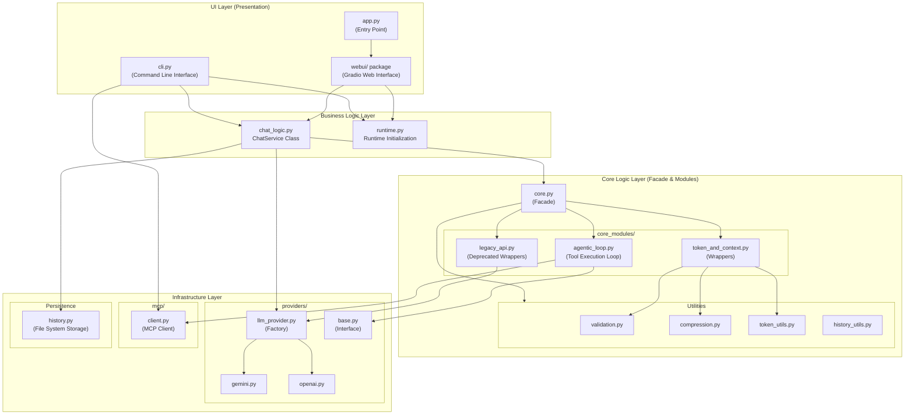

# アーキテクチャ設計書

## 概要

Multi-LLM Chatは、複数のLLM（Gemini、ChatGPT）との対話を統一的に管理するPythonアプリケーションです。
3層アーキテクチャ（UI層、ビジネスロジック層、コアロジック層）を採用し、UIの実装詳細からビジネスロジックを分離することで、CLIとWeb UIの両方で一貫した動作を実現しています。また、Model Context Protocol (MCP) をサポートし、外部ツールとの連携機能も備えています。

## 詳細ドキュメント (New!)

各レイヤーの詳細設計については、以下のドキュメントを参照してください。

*   **[UI層 (Presentation)](architecture/ui_layer.md)**: CLIとWebUI (Gradio) の実装構造、State管理パターン。
*   **[ビジネスロジック層 (Service)](architecture/service_layer.md)**: `ChatService` によるフロー制御、メンション解析、デュアル履歴管理。
*   **[コアロジック層 (Core)](architecture/core_layer.md)**: Agentic Loop (ReAct)、トークン管理、コンテキスト圧縮。
    *   **[Agentic Loop 仕様](specs/agentic_loop_spec.md)**
    *   **[コンテキスト圧縮 仕様](specs/context_compression_spec.md)**
*   **[インフラストラクチャ層 (Infrastructure)](architecture/infrastructure_layer.md)**: LLMプロバイダ実装、MCPクライアント、データ永続化。
    *   **[MCPクライアント 仕様](specs/mcp_client_spec.md)**

## アーキテクチャ全体図

## モジュールリストと役割

### アプリケーション層 (UI & Entry Points)
*   **`src/multi_llm_chat/app.py`**: Web UIアプリケーションのエントリーポイント（後方互換性維持）。
*   **`src/multi_llm_chat/cli.py`**: コマンドラインインターフェースの実装およびMCP統合のエントリーポイント。
*   **`src/multi_llm_chat/webui/`**: GradioベースのWeb UI実装パッケージ。
    *   `app.py`: UI構築のメインロジック。
    *   `state.py`: UIの状態管理（WebUIState）。
    *   `handlers.py`: イベントハンドラロジック。
    *   `components.py`: 再利用可能なUIコンポーネント。

### ビジネスロジック層 (Service)
*   **`src/multi_llm_chat/chat_logic.py`**: アプリケーションのビジネスロジック（状態管理、ルーティング、ストリーミング制御）を提供するサービス層。
*   **`src/multi_llm_chat/runtime.py`**: アプリケーションのランタイム初期化（環境変数読み込み、ログ設定）を行うモジュール。

### コアロジック層 (Core Domain)
*   **`src/multi_llm_chat/core.py`**: コア機能への統一的なアクセスを提供するファサードモジュール。
*   **`src/multi_llm_chat/core_modules/`**: コア機能の実装詳細を格納するパッケージ。
    *   `agentic_loop.py`: ツール使用を含む自律的なエージェントループの実装。
    *   `legacy_api.py`: 後方互換性のための旧API実装。
    *   `token_and_context.py`: トークン計算とコンテキスト管理のラッパー。
*   **`src/multi_llm_chat/validation.py`**: システムプロンプトやコンテキスト長の妥当性を検証するモジュール。
*   **`src/multi_llm_chat/compression.py`**: スライディングウィンドウ方式によるコンテキスト圧縮ロジックを提供するモジュール。
*   **`src/multi_llm_chat/token_utils.py`**: トークン数の見積もりとバッファ計算を行うユーティリティ。
*   **`src/multi_llm_chat/history_utils.py`**: 履歴データのフォーマット変換や定数を管理するユーティリティ。

### インフラストラクチャ層 (Providers, Persistence, MCP)
*   **`src/multi_llm_chat/llm_provider.py`**: 各LLMプロバイダのインスタンス生成と設定を管理するファクトリ。
*   **`src/multi_llm_chat/providers/`**: 各LLMプロバイダの具象クラスを提供するパッケージ。
    *   `base.py`: プロバイダの基底クラス（インターフェース定義）。
    *   `gemini.py`: Google Gemini APIの実装。
    *   `openai.py`: OpenAI ChatGPT APIの実装。
*   **`src/multi_llm_chat/mcp/`**: Model Context Protocol (MCP) クライアント実装を提供するパッケージ。
    *   `client.py`: MCPサーバーとの接続とツール実行を行うクライアント。
*   **`src/multi_llm_chat/history.py`**: 会話履歴のファイルシステムへの永続化と読み込みを担当するモジュール。
