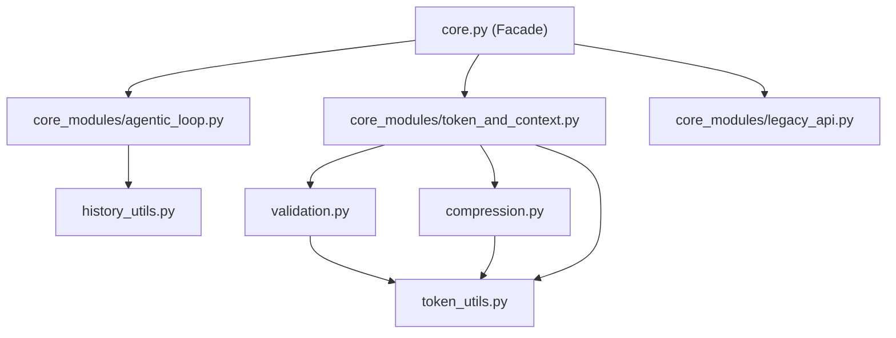
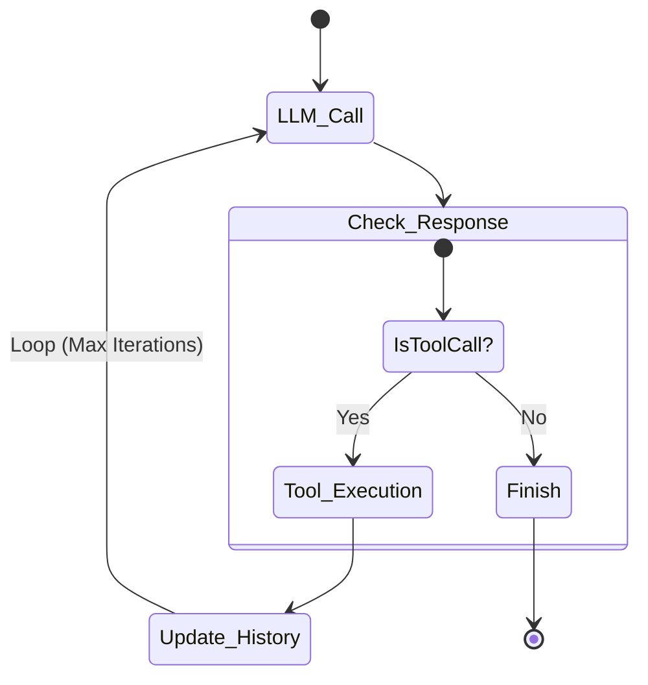

# コアロジック層 (Core Layer) 詳細設計

## 概要

コアロジック層は、特定のUIやアプリケーションの状態に依存しない、純粋なドメインロジックを提供します。
`core.py` がファサードとして機能し、`core_modules/` パッケージ内の実装を隠蔽・統合して公開しています。

## モジュール依存関係図

## 1. Agentic Loop (`src/multi_llm_chat/core_modules/agentic_loop.py`)

LLMの自律的な思考・実行ループ（ReActパターン相当）を実装しています。

### 実行フロー (State Diagram)

関数 `execute_with_tools_stream` は以下のステップを繰り返します（最大反復回数制限あり）。

1.  **LLM呼び出し**: 現在の履歴とシステムプロンプト、利用可能なツール定義（MCPから取得）をLLMに送信します。
2.  **応答解析**:
    *   **テキスト応答のみ**: ループを終了し、最終回答とします。
    *   **ツール呼び出し要求**: 指定されたツール名と引数を抽出します。
3.  **ツール実行 (MCP)**: `MCPClient` を通じて外部ツールを実行します。
4.  **結果フィードバック**: ツールの実行結果を `role: tool` のメッセージとして履歴に追加します。
5.  **再帰**: 更新された履歴を持って Step 1 に戻ります。

このプロセス全体がストリーミング対応しており、ツールの実行状況（「天気予報ツールを呼び出しています...」など）もUI層に逐次通知されます。

## 2. トークン管理 (`src/multi_llm_chat/token_utils.py` / `token_and_context.py`)

LLMのコンテキストウィンドウ制限を遵守するためのロジックです。

*   **トークン見積もり**: 日本語と英語の文字種の違いを考慮したヒューリスティックな計算（`estimate_tokens`）を行います。厳密なトークナイザを使用しないことで、ライブラリ依存を減らし高速化しています。
    *   日本語文字: ~1.5文字/token
    *   ASCII文字: ~4.0文字/token
*   **バッファ計算**: ツール定義が含まれる場合、システムプロンプトのトークン消費量が増えるため、安全係数（Buffer Factor）を動的に調整します（通常1.2倍、ツールあり1.5倍）。

## 3. コンテキスト圧縮 (`src/multi_llm_chat/compression.py`)

履歴がモデルの最大トークン数を超えた場合、スライディングウィンドウ方式で古いメッセージを削除（Pruning）します。

*   **Pruning戦略**:
    *   システムプロンプトは常に保持します。
    *   最新のメッセージから順に保持し、上限を超える古いメッセージを削除します。
    *   **会話ペアの保持**: 「ユーザー発言」と「アシスタント応答」のペアが分断されないように配慮します。

## 4. 検証 (`src/multi_llm_chat/validation.py`)

リクエスト送信前に以下の検証を行います。

*   システムプロンプト単体で制限を超えていないか。
*   最新のターン（ユーザー入力）を追加した状態で制限を超えていないか。

## 5. 履歴ユーティリティ (`src/multi_llm_chat/history_utils.py`)

異なるLLMプロバイダ間での履歴フォーマットの差異を吸収します。
（注: 現在は `ChatService` が標準フォーマットを管理しているため、このモジュールの役割は縮小傾向にありますが、後方互換性のために維持されています。）
