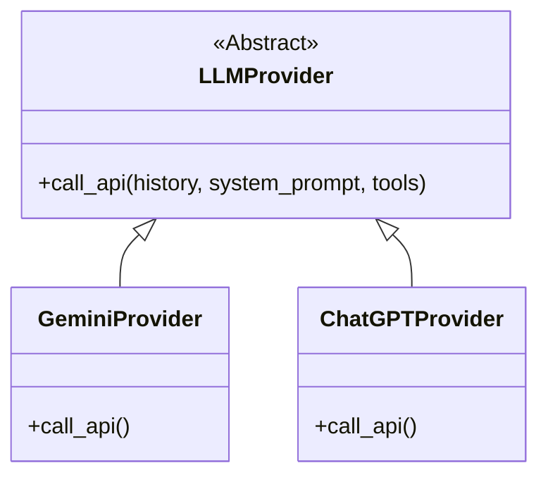
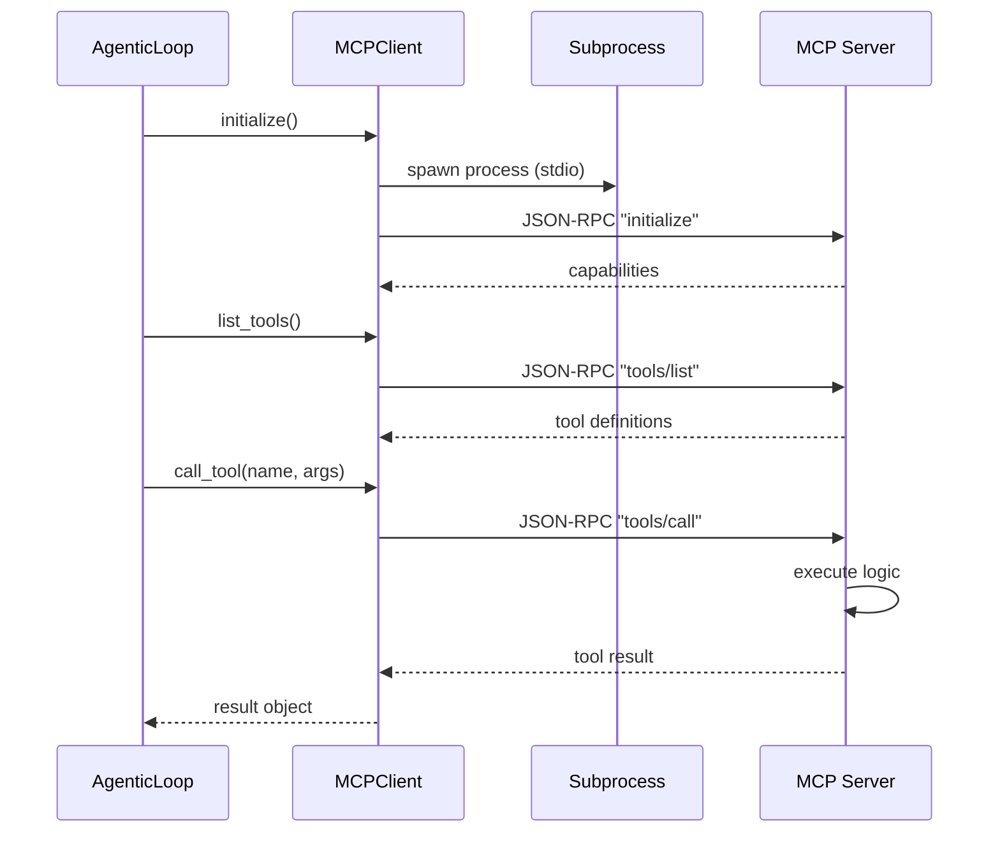

# インフラストラクチャ層 (Infrastructure Layer) 詳細設計

## 概要

インフラストラクチャ層は、外部サービス（LLM API）、外部プロセス（MCPサーバー）、およびファイルシステムへのアクセスを抽象化し、具体的な実装を提供します。

## 1. LLMプロバイダ (`src/multi_llm_chat/providers/`)

Strategyパターンを採用し、異なるLLM APIを統一的なインターフェースで扱えるようにしています。

### クラス図 (Strategy Pattern)



### 実装詳細

*   **`GeminiProvider`**:
    *   Google Generative AI SDK (`google-generativeai`) を使用。
    *   ツール定義を `genai.types.FunctionDeclaration` に変換。
    *   非同期ストリーミング (`generate_content_async(stream=True)`) を利用。

*   **`ChatGPTProvider`**:
    *   OpenAI Python SDK (`openai`) を使用。
    *   ツール定義を OpenAI Function Calling 形式 (`{"type": "function", ...}`) に変換。
    *   `client.chat.completions.create(stream=True)` を利用。

## 2. MCPクライアント (`src/multi_llm_chat/mcp/`)

Model Context Protocol (MCP) に準拠したクライアント実装です。

### 通信シーケンス



### 通信方式
現在は **Stdio (Standard Input/Output)** 方式のみをサポートしています。
Pythonの `asyncio.create_subprocess_exec` を使用してMCPサーバープロセス（例: `uvx mcp-server-weather`）を起動し、標準入出力を通じてJSON-RPCメッセージをやり取りします。

## 3. 永続化 (`src/multi_llm_chat/history.py`)

チャット履歴の保存・読み込みを担当します。現在はローカルファイルシステムを使用しています。

### 保存フォーマット
JSON形式で保存されます。
*   ファイル名: サニタイズされた名前（例: `my_chat.json`）
*   構造:
    ```json
    {
      "display_name": "My Chat",
      "system_prompt": "...",
      "turns": [ ... ],
      "metadata": { "created_at": "...", ... }
    }
    ```

### セキュリティ
*   **パス・トラバーサル対策**: ファイル名のサニタイズ処理を行い、ディレクトリ外へのアクセスを防いでいます。
*   **Git除外**: 保存ディレクトリ（`chat_histories/`）は `.gitignore` に登録されており、誤ってリポジトリにコミットされるのを防ぎます。