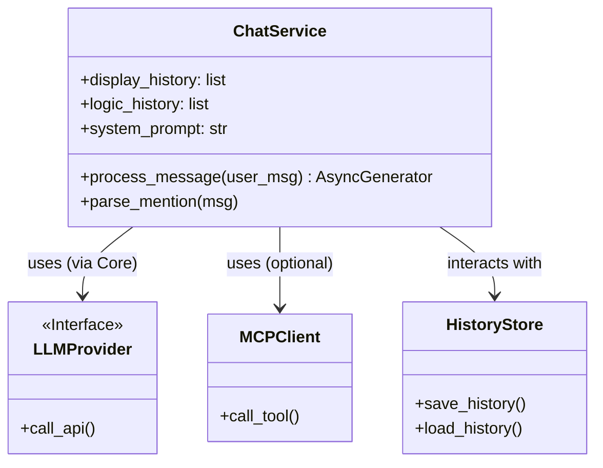
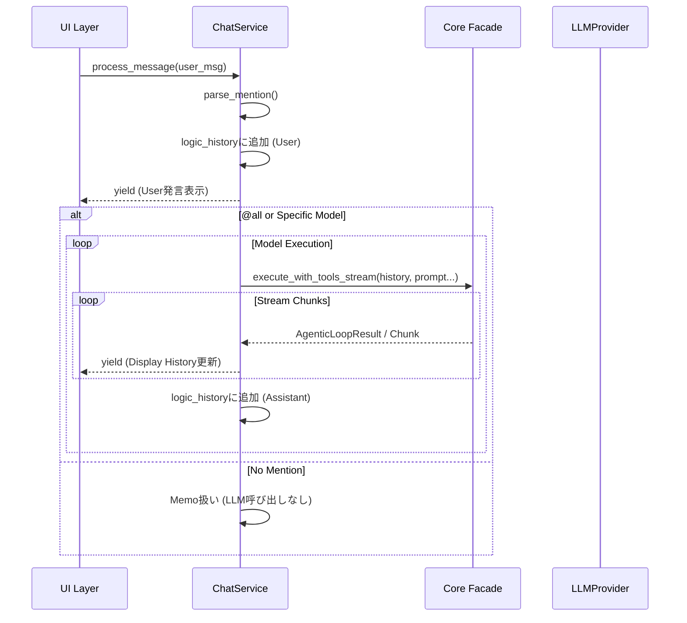

# ビジネスロジック層 (Service Layer) 詳細設計

## 概要

ビジネスロジック層は、UI層とコアロジック層の間に位置し、アプリケーション固有のユースケース（チャットフロー制御）を実現します。
主な責務は **`ChatService`** クラス（`src/multi_llm_chat/chat_logic.py`）に集約されています。

## クラス関係図



## ChatService クラス

このクラスは「セッションスコープ」で生存し、1つのチャットセッションの状態と処理フローを管理します。

### 主要な責務

1.  **メンション解析とルーティング**:
    ユーザーメッセージ内の `@gemini`, `@chatgpt`, `@all` を検出し、適切なLLMプロバイダへリクエストを振り分けます。メンションがない場合は「思考メモ」として履歴に記録するのみとします。

2.  **デュアル履歴管理**:
    UI表示用とAPI送信用の2種類の履歴フォーマットを並行して維持します。
    *   **Logic History (`logic_history`)**: API用。OpenAI/Gemini API仕様に近い形式。
        ```json
        [{"role": "user", "content": [...]}, {"role": "gemini", "content": [...]}]
        ```
    *   **Display History (`display_history`)**: UI用。GradioのChatbotコンポーネント形式。
        ```python
        [["ユーザー発言", "アシスタント応答"], [None, "追加の応答"]]
        ```

3.  **ストリーミング応答の統合**:
    Core層の `execute_with_tools_stream` から返される非同期ジェネレータを消費し、UI層が扱いやすい形式（履歴の更新差分）に変換して再送出（yield）します。

4.  **@all（並列/順次）処理の制御**:
    `@all` メンションが使用された場合、以下の手順で処理を行います。
    1.  現在の履歴のスナップショットを作成（両モデルに同じコンテキストを与えるため）。
    2.  Geminiプロバイダを実行し、結果を表示・履歴に追加。
    3.  ChatGPTプロバイダを実行し、結果を表示・履歴に追加。
    *   ※現在は順次実行ですが、アーキテクチャ上は並列実行への拡張も可能です。

### データフロー（メッセージ処理）



## エラーハンドリング

APIエラーやネットワークエラーが発生した場合、`ChatService` は例外を捕捉し、以下の処理を行います。
1.  **UIへのフィードバック**: エラーメッセージをアシスタントの応答として整形し、赤字などで表示されるように Markdown を生成します。
2.  **履歴への記録**: エラー発生事実をシステムメッセージとして履歴に残し、文脈が途切れないようにします。

## 依存関係

`ChatService` は以下のコンポーネントに依存しますが、具体的な実装クラスではなく、インターフェースやファクトリを通じて利用します。

*   `LLMProvider` (Interface): Gemini/ChatGPTの具体実装を知る必要はありません。
*   `MCPClient` (Optional): ツール実行が必要な場合に利用されます。