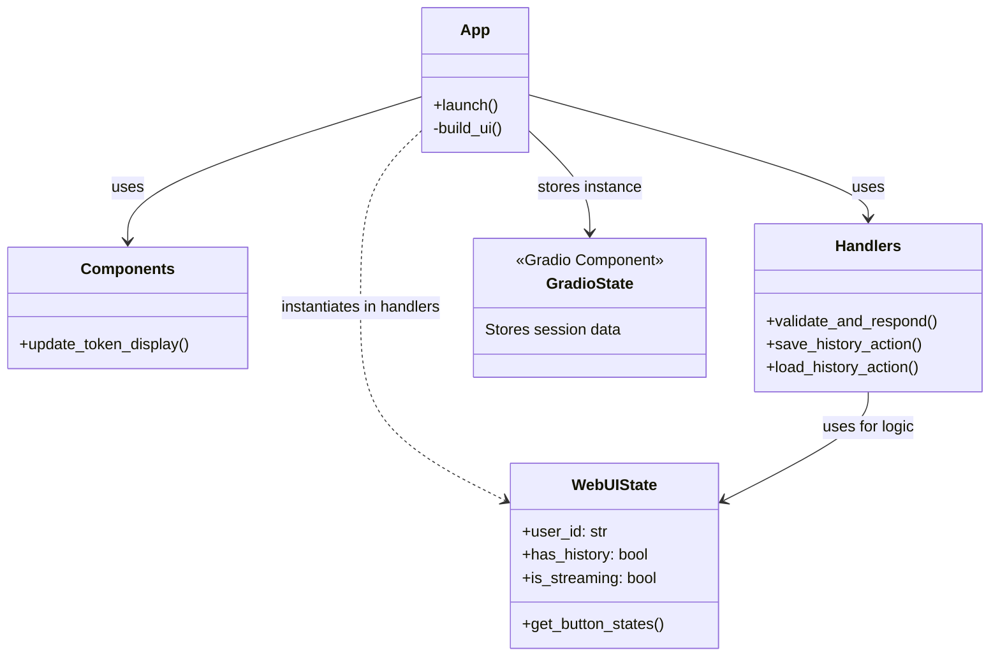
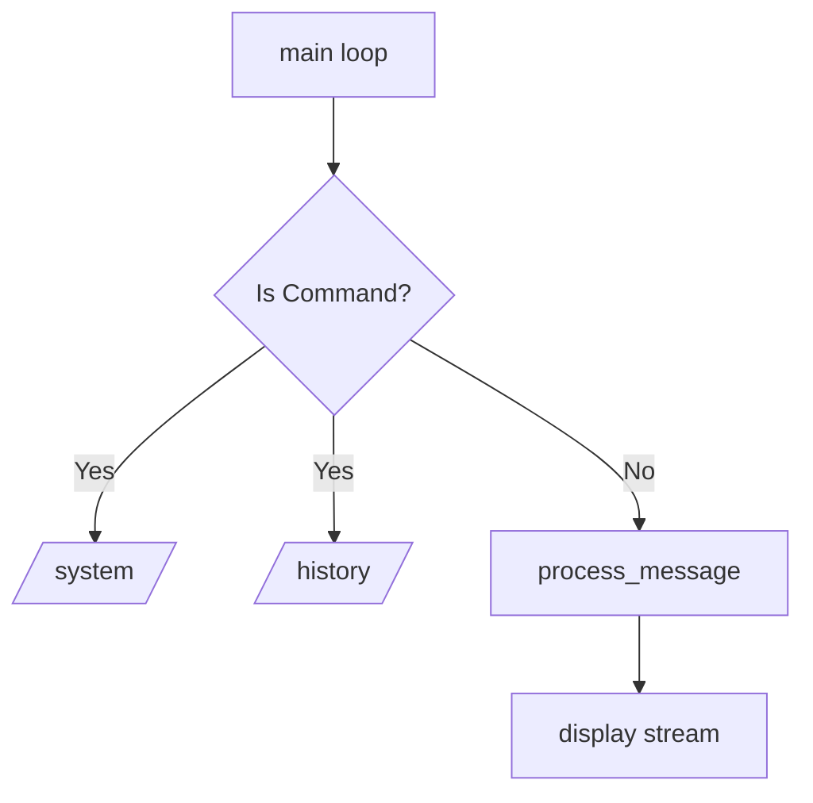

# UI層 (Presentation Layer) 詳細設計

## 概要

UI層はユーザーとの対話を担当し、ユーザーからの入力を受け取ってビジネスロジック層（Service Layer）に伝達し、結果を表示します。
本プロジェクトでは、**CLI (Command Line Interface)** と **Web UI (Gradio)** の2つのインターフェースを提供しています。

## 1. Web UI (`src/multi_llm_chat/webui/`)

Gradioフレームワークを使用したWebインターフェースです。Epic 009およびIssue #58のリファクタリングにより、UI定義、状態管理、イベントハンドラが明確に分離されています。

### クラス・モジュール関係図



### モジュール構成

| モジュール | 役割 |
|Data | Description|
|---|---|
| `app.py` | UIコンポーネントの配置（Layout）とイベントの配線（Wiring）を担当するエントリーポイント。 |
| `state.py` | 画面の状態（ボタンの有効/無効、表示テキストなど）を一元管理する `WebUIState` クラスを定義。 |
| `handlers.py` | ユーザーのアクション（保存、ロード、送信など）に対する具体的な処理ロジック。Gradioへの依存を最小限に抑えています。 |
| `components.py` | 再利用可能なUI部品（例: トークン表示更新関数）の定義。 |

### 状態管理パターン (WebUIState)

UIの複雑な状態遷移（例：ストリーミング中は送信ボタンを無効化、履歴読み込み後は新規チャットボタンを有効化など）を管理するために、`WebUIState` クラスを導入しています。

```python
# 概念コード
class WebUIState:
    def __init__(self, user_id, has_history, is_streaming, ...):
        # 状態変数の初期化
        ...

    def get_button_states(self):
        # 現在の状態に基づいて、各ボタンの interactive (有効/無効) 状態を辞書で返す
        return {
            "send_button": gr.update(interactive=self.can_send),
            "save_history_btn": gr.update(interactive=self.has_content),
            ...
        }
```

このパターンにより、`app.py` 内のイベントハンドラは「どのボタンを有効にすべきか」というロジックから解放され、単に `state.get_button_states()` の結果をUIに適用するだけで済みます。

### ストリーミング更新フロー

Gradioのジェネレータ機能を利用して、LLMからの応答をリアルタイムに表示します。

1.  **送信開始**: ユーザー入力と現在の履歴を `handle_chat_submission` に渡す。
2.  **UIロック**: `WebUIState` を使用して送信ボタン等を無効化。
3.  **処理委譲**: `ChatService.process_message` (非同期ジェネレータ) を呼び出す。
4.  **逐次更新**: ジェネレータから `(display_history, logic_history)` が返されるたびに `chatbot_ui` コンポーネントを更新。
5.  **完了**: ストリーミング終了後、`WebUIState` を使用してUIロックを解除し、トークン数を更新。

## 2. CLI (`src/multi_llm_chat/cli.py`)

Pythonの標準入出力を使用したシンプルなコマンドラインインターフェースです。

### 構造図



### 構成要素

*   **メインループ (`main`)**: ユーザー入力を待ち受け、コマンドかチャットメッセージかを判定します。
*   **コマンド処理**: `/system` や `/history` などのスラッシュコマンドを処理します。
*   **ストリーミング表示 (`_process_service_stream`)**: `ChatService` からの出力を受け取り、ターミナル上に逐次表示します。
*   **MCPクライアント統合**: 必要に応じて `MCPClient` を初期化し、セッションを開始します。

### CLI固有の表示ロジック

`ChatService` はUIに中立な `display_history`（Markdown形式のチャットログ）を提供しますが、CLIではこれをそのまま表示するのではなく、増分（Delta）のみを抽出して表示する工夫を行っています。

*   **ツール出力**: `ChatService` から `type: "tool_call"` や `tool_result` のチャンクが流れてきた場合、特別なフォーマットで表示します。
*   **モデル切り替え表示**: `@all` メンションなどで複数のモデルが順次応答する場合、モデル名のヘッダー（例: `[Gemini]:`）を表示して区切りを明確にします。