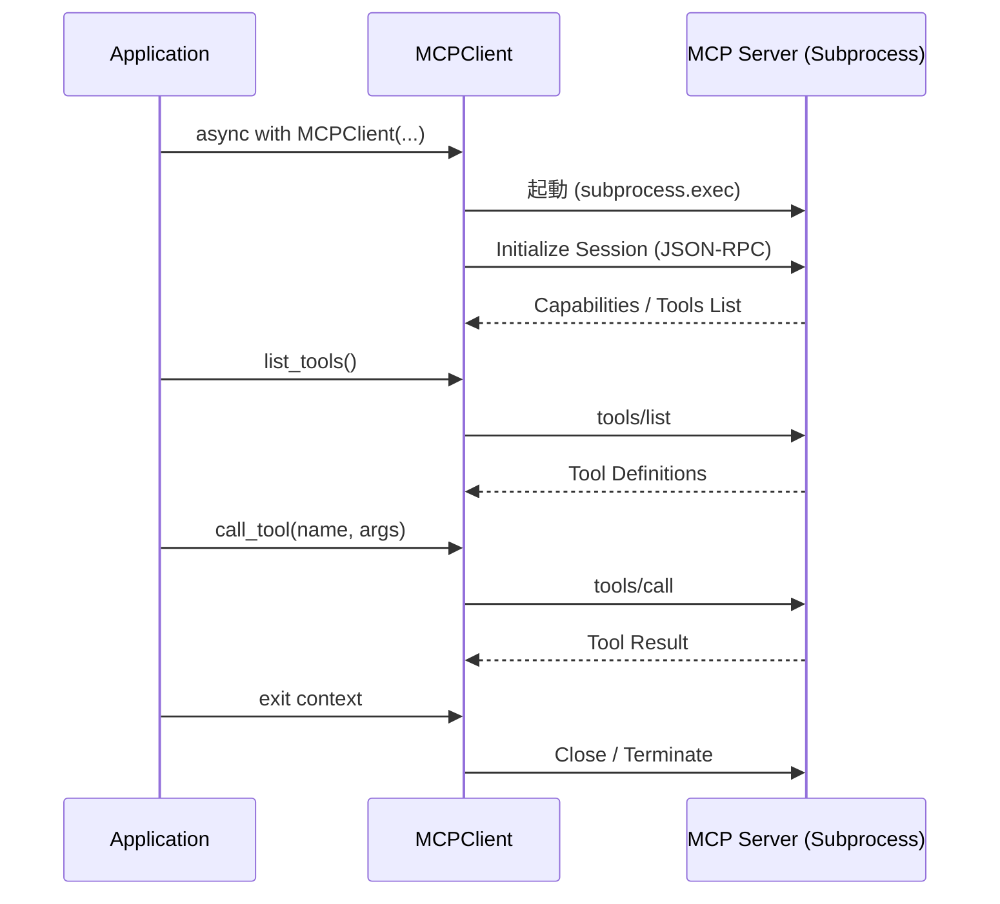

# Model Context Protocol (MCP) クライアント仕様

## 1. 概要

Model Context Protocol (MCP) は、AIモデルが外部データやツールと安全にやり取りするための標準プロトコルです。
Multi-LLM Chatでは、MCPを利用してLLM（Gemini, ChatGPT）が外部ツール（天気予報、データベース検索など）を呼び出せるようにしています。

本ドキュメントでは、`src/multi_llm_chat/mcp/client.py` に実装されているMCPクライアントの仕様について記述します。

## 2. アーキテクチャ

MCPクライアントは、以下のコンポーネントで構成されています。

*   **MCPClient (`src/multi_llm_chat/mcp/client.py`)**: アプリケーション側のクライアント実装。
*   **MCP Server**: 外部プロセスとして動作するサーバー（例: `uvx mcp-server-weather`）。
*   **Stdio Transport**: クライアントとサーバー間の通信チャネル（標準入力/標準出力）。



## 3. 機能仕様

### 3.1 接続管理

MCPクライアントは、Pythonの非同期コンテキストマネージャ（`async with`）として実装されており、セッションのライフサイクルを自動管理します。

*   **初期化**: サーバー起動コマンド（例: `uvx`）と引数を受け取ります。
*   **接続**: サブプロセスを起動し、stdioパイプを接続してMCPセッションを確立します。
*   **切断**: セッションを閉じ、サブプロセスを安全に終了（terminate/kill）します。

```python
from multi_llm_chat.mcp.client import MCPClient

client = MCPClient("uvx", ["mcp-server-weather"])
async with client:
    # セッション有効範囲
    pass
# ここで自動的に切断・プロセス終了
```

### 3.2 ツール一覧取得 (`list_tools`)

接続されたMCPサーバーが提供するツールの一覧を取得します。

*   **入力**: なし
*   **出力**: ツール定義のリスト
    ```json
    [
      {
        "name": "get_weather",
        "description": "Get current weather for a location",
        "inputSchema": { ...json-schema... }
      }
    ]
    ```

### 3.3 ツール実行 (`call_tool`)

特定のツールを実行し、結果を取得します。

*   **入力**:
    *   `name` (str): ツール名
    *   `arguments` (dict): 引数
*   **出力**: 実行結果の辞書
    ```json
    {
      "content": [
        {
          "type": "text",
          "text": "The weather in Tokyo is sunny, 25°C."
        }
      ],
      "isError": false
    }
    ```

## 4. エラーハンドリング

*   **ConnectionError**:
    *   サーバープロセスの起動失敗時
    *   初期化タイムアウト時
    *   セッション未確立状態でのメソッド呼び出し時
*   **TimeoutError**:
    *   初期化やツール実行が指定されたタイムアウト時間を超えた場合

## 5. 制限事項

*   現在は `stdio` トランスポートのみをサポートしています（HTTP/SSEは未サポート）。
*   1つの `MCPClient` インスタンスは1つのサーバープロセスに対応します。複数のサーバーを使用する場合は、複数のクライアントインスタンスが必要です。
