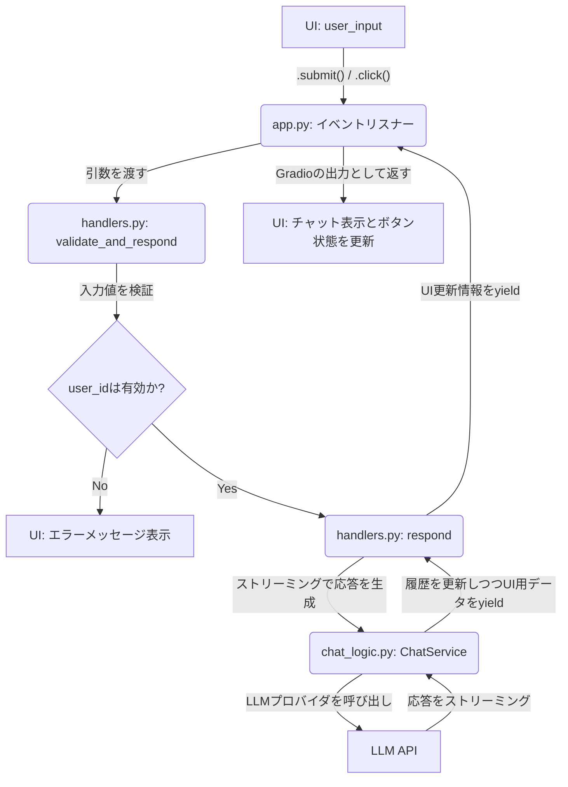

# WebUIリファクタリング設計 (Issue #41)

## 1. 目的

このリファクタリングは、Issue #41で指摘された以下の問題を解決することを目的とします。

- **`respond` 関数の責務過多**: 巨大な `respond` 関数が入力検証、UI状態管理、ビジネスロジック呼び出しなど、多数の責務を担っており、単一責任の原則に違反していた。
- **UI状態管理の分散**: ボタンの有効/無効状態などを決定するロジックが、UIコード内の複数の場所に散らばっており、見通しが悪く、変更が困難だった。

このリファクタリングにより、コードの保守性、可読性、拡張性を向上させ、将来の機能追加を容易にします。

## 2. 新しいファイル構成

WebUIの関心を分離するため、`src/multi_llm_chat/webui/` パッケージを以下のファイル構成に再編成しました。

- **`app.py`**:
  - **責務**: GradioアプリケーションのUIコンポーネントを定義し、それらをイベントハンドラに接続する。UIのレイアウトとイベントチェーンの全体像を管理する。
  - **詳細**: UIの骨格（`gr.Blocks`, `gr.Button`など）の定義と、`.click()` や `.submit()` によるイベントとハンドラの紐付けのみを担当する。

- **`handlers.py`**:
  - **責務**: GradioのUIイベントに応じて実行される具体的な処理を実装する。ビジネスロジック（`ChatService`）やデータ永続化（`HistoryStore`）の呼び出しを担う。
  - **詳細**: `handle_chat_submission`, `handle_save_history` など、ユーザーのアクションに直接対応する関数群。

- **`state.py`**:
  - **責務**: WebUIの状態を一元的に管理する。特に、UIコンポーネント（ボタンなど）の状態（表示/非表示、有効/無効）を決定するロジックを集約する。
  - **詳細**: `WebUIState` クラスを定義。ユーザーID、ストリーミング状態、履歴の有無などの現在の状況を受け取り、各ボタンがどうあるべきかを決定する `get_button_states()` メソッドを提供する。

- **`components.py`**:
  - **責務**: UI間で共有される静的なコンポーネントや定数、単純なUI関連ユーティリティ関数を配置する。
  - **詳細**: `ASSISTANT_LABELS` のような定数や、トークン数を計算して表示用文字列を返す `update_token_display` のような、状態に依存しないヘルパー関数が含まれる。

## 3. UI状態管理の新しいフロー

UIの状態管理は `WebUIState` クラスに集約されました。

1. **状態の決定**: ユーザー入力やサーバーからの応答など、UIの状態に影響を与えるイベントが発生します。
2. **`WebUIState` の利用**: イベントハンドラは、現在の状況（ユーザーID、会話履歴の有無、ストリーミング中かどうか等）を引数として `WebUIState` インスタンスを生成します。
3. **状態の取得**: `.get_button_states()` メソッドを呼び出し、全てのUIコンポーネントの望ましい状態（例: `{"send_button": gr.update(interactive=True)}`）を辞書として取得します。
4. **UIの更新**: ハンドラは取得した状態辞書を使って、Gradioの出力としてUIコンポーネントを一括で更新します。

これにより、「いつ、どのボタンが有効になるか」というロジックが `state.py` に集約され、UIの挙動の把握や変更が容易になりました。

## 4. イベントハンドラの処理の流れ

ユーザーがメッセージを送信した際の主要な処理フローは以下の通りです。

このフローのポイントは、`validate_and_respond` と `respond` の責務が明確に分離された点です。

- **`validate_and_respond`**: UI層のガード節として機能し、`user_id` のような必須入力の検証のみを行います。
- **`respond`**: 検証済みの入力に基づき、純粋なチャット処理（`ChatService` の呼び出し）に専念します。

これにより、コアロジックはUIの入力形式に依存せず、再利用性が高まりました。